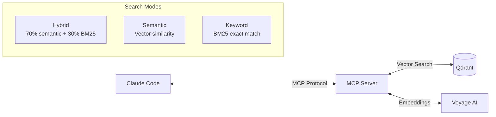

# MCP Memory Server with Qdrant

> **v2.8** | Semantic code memory for Claude Code via Model Context Protocol

[](https://smithery.ai/server/@delorenj/mcp-qdrant-memory)

This MCP server provides a knowledge graph implementation with semantic search capabilities powered by Qdrant vector database. **Enhanced version** for Claude Code memory solution.

---

## Architecture



---

## Features

| Feature | Description |
|---------|-------------|
| **Hybrid Search** | BM25 + semantic search with RRF fusion |
| **Progressive Disclosure** | Metadata-first responses, details on-demand |
| **Multi-Collection** | Work with multiple projects simultaneously |
| **Token Management** | 25k token compliance with auto-reduction |
| **Entity-Specific Filtering** | Focus on individual components |

---

## Quick Start

### 1. Install Dependencies

```bash
npm install
```

### 2. Build the Server

```bash
npm run build
```

### 3. Configure Environment

```bash
# Required
QDRANT_URL=http://localhost:6333
QDRANT_COLLECTION_NAME=your-collection

# Embeddings (choose one)
VOYAGE_API_KEY=your-voyage-key        # Recommended (85% cost savings)
EMBEDDING_PROVIDER=voyage
EMBEDDING_MODEL=voyage-3-lite

# OR
OPENAI_API_KEY=your-openai-key        # Alternative
```

### 4. Add to Claude Code

Add to your `.mcp.json`:

```json
{
  "mcpServers": {
    "your-project-memory": {
      "command": "node",
      "args": ["/path/to/mcp-qdrant-memory/dist/index.js"],
      "env": {
        "VOYAGE_API_KEY": "your-key",
        "QDRANT_URL": "http://localhost:6333",
        "QDRANT_COLLECTION_NAME": "your-collection"
      }
    }
  }
}
```

---

## MCP Tools

### search_similar

Semantic search with hybrid BM25 support.

```typescript
search_similar({
  query: string,           // Search query
  entityTypes?: string[],  // Filter: ["function", "class", "metadata", "implementation"]
  limit?: number,          // Max results (default: 50)
  searchMode?: string      // "hybrid" | "semantic" | "keyword"
})
```

**Search Modes:**

| Mode | Best For | Score Range |
|------|----------|-------------|
| `hybrid` (default) | General queries | 0.4-1.2 |
| `semantic` | Conceptual searches | 0.6-0.8 |
| `keyword` | Exact identifiers | 1.5+ |

**Examples:**

```python
# Find authentication code
mcp__project__search_similar("user authentication", limit=10)

# Fast metadata scan
mcp__project__search_similar("auth", entityTypes=["metadata"])

# Exact function name
mcp__project__search_similar("validateToken", searchMode="keyword")
```

---

### read_graph

Read knowledge graph with multiple viewing modes.

```typescript
read_graph({
  entity?: string,         // Focus on specific entity
  mode?: string,           // "smart" | "entities" | "relationships" | "raw"
  entityTypes?: string[],  // Filter entity types
  limit?: number           // Max entities per type
})
```

**Modes:**

| Mode | Description | Token Usage |
|------|-------------|-------------|
| `smart` | AI-optimized summary | <25k |
| `entities` | Entity list only | ~10k |
| `relationships` | Relations only | ~5k |
| `raw` | Complete data | May exceed limits |

**Examples:**

```python
# Entity-specific analysis
mcp__project__read_graph(entity="AuthService", mode="smart")

# See function relationships
mcp__project__read_graph(entity="process_login", mode="relationships")

# Get all classes
mcp__project__read_graph(mode="entities", entityTypes=["class"])
```

---

### get_implementation

Retrieve implementation details with scope control.

```typescript
get_implementation({
  entityName: string,      // Entity to retrieve
  scope?: string           // "minimal" | "logical" | "dependencies"
})
```

**Scopes:**

| Scope | Returns | Token Usage |
|-------|---------|-------------|
| `minimal` | Just the entity | ~500-2k |
| `logical` | Entity + same-file helpers | ~2k-5k |
| `dependencies` | Entity + imported modules | ~5k-15k |

**Examples:**

```python
# Get just the function
mcp__project__get_implementation("parseAST")

# Get with local helpers
mcp__project__get_implementation("parseAST", scope="logical")

# Get with all dependencies
mcp__project__get_implementation("parseAST", scope="dependencies")
```

---

### Entity Management

```typescript
// Create entities
create_entities({
  entities: [{
    name: string,
    entityType: string,
    observations: string[]
  }]
})

// Add observations to existing entity
add_observations({
  observations: [{
    entityName: string,
    contents: string[]
  }]
})

// Delete entities
delete_entities({ entityNames: string[] })

// Create relations
create_relations({
  relations: [{
    from: string,
    to: string,
    relationType: string
  }]
})
```

---

## Multi-Project Support

All tools accept an optional `collection` parameter:

```python
# Default collection (from env)
mcp__memory__search_similar("auth")

# Explicit collection
mcp__memory__search_similar("auth", collection="project-a")
mcp__memory__search_similar("auth", collection="project-b")
```

---

## Smart Mode Response

The `smart` mode returns a structured, token-optimized response:

```typescript
{
  summary: {
    totalEntities: number,
    totalRelations: number,
    breakdown: { class: 195, function: 292, ... },
    keyModules: ["storage", "analysis", "embeddings"]
  },
  apiSurface: {
    classes: [{ name, file, line, docstring, methods }],
    functions: [{ name, file, line, signature, docstring }]
  },
  dependencies: {
    external: ["openai", "qdrant"],
    internal: [{ from, to }]
  }
}
```

---

## Docker Setup

```bash
# Build
docker build -t mcp-qdrant-memory .

# Run
docker run -d \
  -e VOYAGE_API_KEY=your-key \
  -e QDRANT_URL=http://qdrant:6333 \
  -e QDRANT_COLLECTION_NAME=your-collection \
  mcp-qdrant-memory
```

---

## Performance

| Operation | Latency | Notes |
|-----------|---------|-------|
| Metadata search | 3-5ms | Fast scanning |
| Hybrid search | 30-50ms | Full search |
| Smart graph | 100-200ms | Token-optimized |
| Implementation | 50-100ms | Depends on scope |

---

## Related Documentation

- [Architecture](../ARCHITECTURE.md) - System design
- [CLI Reference](../docs/CLI_REFERENCE.md) - Indexer commands
- [Hooks System](../docs/HOOKS.md) - Claude Code integration

---

## License

MIT
