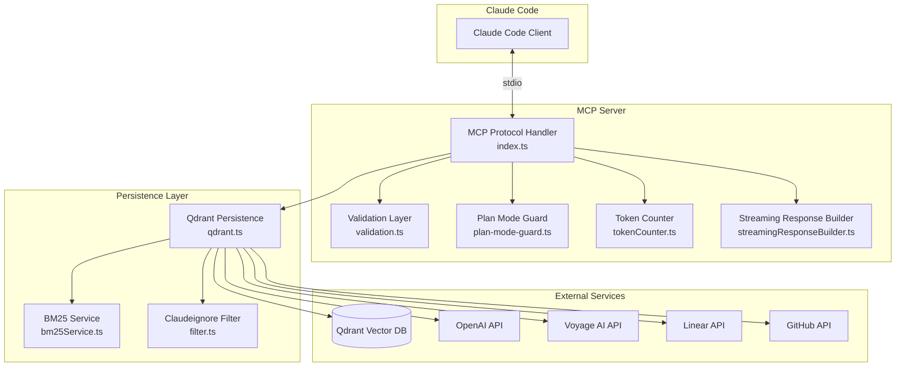
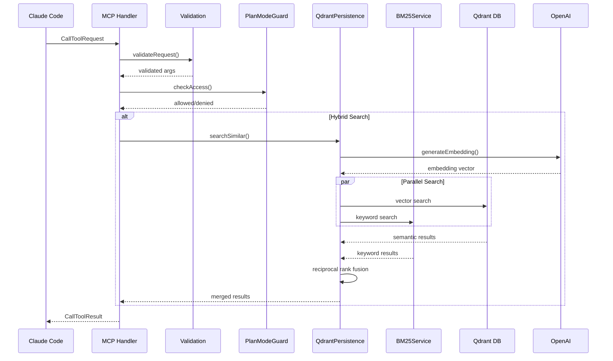

# MCP-Qdrant-Memory Technical Design Document

**Version:** 1.0.0
**Status:** Draft
**Author:** Ryan Lefkowitz
**Last Updated:** December 2025
**Related:** [PRD.md](./PRD.md)

---

## Table of Contents

1. [Overview](#1-overview)
2. [Current Architecture](#2-current-architecture)
3. [Design Decisions](#3-design-decisions)
4. [Implementation Details](#4-implementation-details)
5. [API Changes](#5-api-changes)
6. [Migration Guide](#6-migration-guide)
7. [Testing Strategy](#7-testing-strategy)
8. [Rollout Plan](#8-rollout-plan)
9. [Appendices](#9-appendices)

---

## 1. Overview

### 1.1 Purpose

This document provides technical specifications for enhancing the `mcp-qdrant-memory` MCP server with:

- Comprehensive testing infrastructure
- CI/CD pipeline automation
- Code quality tooling
- Improved error handling
- Security hardening
- Resource management improvements

### 1.2 Scope

This TDD covers implementation details for all requirements defined in [PRD.md](./PRD.md), organized by technical domain rather than priority.

### 1.3 Terminology

| Term                   | Definition                                                                 |
| ---------------------- | -------------------------------------------------------------------------- |
| MCP                    | Model Context Protocol - communication protocol for Claude Code extensions |
| BM25                   | Best Matching 25 - keyword-based ranking algorithm                         |
| Hybrid Search          | Combination of semantic (vector) and keyword (BM25) search                 |
| Progressive Disclosure | Pattern of returning metadata first, implementation on demand              |

---

## 2. Current Architecture

### 2.1 System Diagram



### 2.2 File Structure

```
mcp-qdrant-memory/
├── src/
│   ├── index.ts                 # Main entry, MCP handlers (1038 lines)
│   ├── config.ts                # Environment configuration (34 lines)
│   ├── types.ts                 # TypeScript type definitions (213 lines)
│   ├── validation.ts            # Request validation (510 lines)
│   ├── tokenCounter.ts          # Token estimation (241 lines)
│   ├── streamingResponseBuilder.ts  # Response building (546 lines)
│   ├── fetch-override.ts        # Fetch API wrapper (7 lines)
│   ├── plan-mode-guard.ts       # Plan mode access control (164 lines)
│   ├── persistence/
│   │   └── qdrant.ts            # Qdrant operations (~1200 lines)
│   ├── bm25/
│   │   └── bm25Service.ts       # BM25 search (331 lines)
│   └── claudeignore/
│       ├── filter.ts            # File filtering (289 lines)
│       └── index.ts             # Module export (9 lines)
├── docs/
│   ├── PRD.md                   # Product requirements
│   └── TDD.md                   # This document
├── package.json
├── tsconfig.json
└── Dockerfile
```

### 2.3 Data Flow



---

## 3. Design Decisions

### 3.1 Testing Architecture

#### 3.1.1 Framework Selection: Vitest

**Decision:** Use Vitest (already installed) as the test framework.

**Rationale:**

- Native TypeScript support without transpilation
- Fast execution with native ESM support
- Compatible with Jest assertions for familiar API
- Built-in coverage reporting
- UI mode for development

**Alternatives Considered:**
| Framework | Pros | Cons | Decision |
|-----------|------|------|----------|
| Jest | Industry standard | Requires ts-jest, slower | Rejected |
| Vitest | Fast, native TS | Less ecosystem | **Selected** |
| Mocha | Flexible | Needs assertion library | Rejected |

#### 3.1.2 Test Organization

```
src/
├── __tests__/
│   ├── unit/
│   │   ├── validation.test.ts
│   │   ├── tokenCounter.test.ts
│   │   ├── bm25Service.test.ts
│   │   ├── planModeGuard.test.ts
│   │   └── streamingResponseBuilder.test.ts
│   ├── integration/
│   │   ├── qdrant.test.ts
│   │   ├── mcp-handlers.test.ts
│   │   └── hybrid-search.test.ts
│   ├── fixtures/
│   │   ├── entities.json
│   │   ├── relations.json
│   │   ├── searchResults.json
│   │   └── embeddings.json
│   └── mocks/
│       ├── qdrantClient.mock.ts
│       ├── openai.mock.ts
│       └── fetch.mock.ts
```

#### 3.1.3 Mocking Strategy

**Qdrant Client Mock:**

```typescript
// src/__tests__/mocks/qdrantClient.mock.ts
import { vi } from "vitest";

export const mockQdrantClient = {
  getCollections: vi.fn().mockResolvedValue({ collections: [] }),
  createCollection: vi.fn().mockResolvedValue(true),
  upsert: vi.fn().mockResolvedValue({ status: "ok" }),
  search: vi.fn().mockResolvedValue([]),
  scroll: vi.fn().mockResolvedValue({ points: [], next_page_offset: null }),
  delete: vi.fn().mockResolvedValue({ status: "ok" }),
};

export const createMockQdrantClient = () => ({
  ...mockQdrantClient,
  // Reset all mocks
  _reset: () => Object.values(mockQdrantClient).forEach((fn) => fn.mockReset()),
});
```

**OpenAI Mock:**

```typescript
// src/__tests__/mocks/openai.mock.ts
import { vi } from "vitest";

// Fixed 1536-dimension embedding for deterministic tests
const MOCK_EMBEDDING = new Array(1536).fill(0).map((_, i) => Math.sin(i * 0.1));

export const mockOpenAI = {
  embeddings: {
    create: vi.fn().mockResolvedValue({
      data: [{ embedding: MOCK_EMBEDDING }],
    }),
  },
};
```

**Fetch Mock (for Linear/GitHub):**

```typescript
// src/__tests__/mocks/fetch.mock.ts
import { vi } from "vitest";

export const mockFetch = vi.fn();

export const setupFetchMock = () => {
  globalThis.fetch = mockFetch;
};

export const mockLinearResponse = (data: any) => {
  mockFetch.mockResolvedValueOnce({
    ok: true,
    json: async () => ({ data }),
  });
};
```

#### 3.1.4 Vitest Configuration

```typescript
// vitest.config.ts
import { defineConfig } from "vitest/config";

export default defineConfig({
  test: {
    globals: true,
    environment: "node",
    include: ["src/**/*.test.ts", "src/**/*.spec.ts"],
    exclude: ["node_modules", "dist"],
    coverage: {
      provider: "v8",
      reporter: ["text", "json", "html", "lcov"],
      reportsDirectory: "./coverage",
      include: ["src/**/*.ts"],
      exclude: ["src/**/*.test.ts", "src/**/*.spec.ts", "src/__tests__/**", "src/types.ts"],
      thresholds: {
        lines: 80,
        functions: 80,
        branches: 75,
        statements: 80,
      },
    },
    setupFiles: ["src/__tests__/setup.ts"],
    testTimeout: 10000,
    hookTimeout: 10000,
  },
});
```

**Test Setup File:**

```typescript
// src/__tests__/setup.ts
import { vi, beforeEach, afterEach } from "vitest";

// Reset all mocks between tests
beforeEach(() => {
  vi.clearAllMocks();
});

// Clean up any timers
afterEach(() => {
  vi.useRealTimers();
});

// Mock environment variables
vi.stubEnv("OPENAI_API_KEY", "sk-test-key");
vi.stubEnv("QDRANT_URL", "http://localhost:6333");
vi.stubEnv("QDRANT_COLLECTION_NAME", "test-collection");
```

---

### 3.2 CI/CD Architecture

#### 3.2.1 GitHub Actions Workflow Design

```yaml
# .github/workflows/ci.yml
name: CI

on:
  push:
    branches: [main, master]
  pull_request:
    branches: [main, master]

concurrency:
  group: ${{ github.workflow }}-${{ github.ref }}
  cancel-in-progress: true

jobs:
  build:
    name: Build
    runs-on: ubuntu-latest
    steps:
      - uses: actions/checkout@v4

      - name: Setup Node.js
        uses: actions/setup-node@v4
        with:
          node-version: "20"
          cache: "npm"

      - name: Install dependencies
        run: npm ci

      - name: Build
        run: npm run build

      - name: Upload build artifacts
        uses: actions/upload-artifact@v4
        with:
          name: dist
          path: dist/
          retention-days: 1

  lint:
    name: Lint
    runs-on: ubuntu-latest
    steps:
      - uses: actions/checkout@v4

      - name: Setup Node.js
        uses: actions/setup-node@v4
        with:
          node-version: "20"
          cache: "npm"

      - name: Install dependencies
        run: npm ci

      - name: Run ESLint
        run: npm run lint

      - name: Check formatting
        run: npm run format:check

  typecheck:
    name: Type Check
    runs-on: ubuntu-latest
    steps:
      - uses: actions/checkout@v4

      - name: Setup Node.js
        uses: actions/setup-node@v4
        with:
          node-version: "20"
          cache: "npm"

      - name: Install dependencies
        run: npm ci

      - name: Run TypeScript compiler
        run: npm run typecheck

  test:
    name: Test (Node ${{ matrix.node-version }})
    runs-on: ubuntu-latest
    strategy:
      matrix:
        node-version: [18, 20, 22]
    steps:
      - uses: actions/checkout@v4

      - name: Setup Node.js ${{ matrix.node-version }}
        uses: actions/setup-node@v4
        with:
          node-version: ${{ matrix.node-version }}
          cache: "npm"

      - name: Install dependencies
        run: npm ci

      - name: Run tests with coverage
        run: npm run test:coverage

      - name: Upload coverage report
        if: matrix.node-version == 20
        uses: codecov/codecov-action@v4
        with:
          files: ./coverage/lcov.info
          fail_ci_if_error: false

  security:
    name: Security Audit
    runs-on: ubuntu-latest
    steps:
      - uses: actions/checkout@v4

      - name: Setup Node.js
        uses: actions/setup-node@v4
        with:
          node-version: "20"
          cache: "npm"

      - name: Install dependencies
        run: npm ci

      - name: Run npm audit
        run: npm audit --audit-level=high
```

#### 3.2.2 Release Workflow

```yaml
# .github/workflows/release.yml
name: Release

on:
  push:
    tags:
      - "v*.*.*"

jobs:
  release:
    name: Release
    runs-on: ubuntu-latest
    permissions:
      contents: write
      id-token: write
    steps:
      - uses: actions/checkout@v4

      - name: Setup Node.js
        uses: actions/setup-node@v4
        with:
          node-version: "20"
          cache: "npm"
          registry-url: "https://registry.npmjs.org"

      - name: Install dependencies
        run: npm ci

      - name: Build
        run: npm run build

      - name: Run tests
        run: npm test

      - name: Publish to npm
        run: npm publish --provenance --access public
        env:
          NODE_AUTH_TOKEN: ${{ secrets.NPM_TOKEN }}

      - name: Create GitHub Release
        uses: softprops/action-gh-release@v1
        with:
          generate_release_notes: true
```

#### 3.2.3 Dependabot Configuration

```yaml
# .github/dependabot.yml
version: 2
updates:
  - package-ecosystem: "npm"
    directory: "/"
    schedule:
      interval: "weekly"
      day: "monday"
    open-pull-requests-limit: 10
    commit-message:
      prefix: "chore(deps)"
    labels:
      - "dependencies"
    groups:
      dev-dependencies:
        patterns:
          - "@types/*"
          - "typescript"
          - "vitest"
          - "eslint*"
          - "prettier"
```

---

### 3.3 Error Handling Design

#### 3.3.1 Result Type Pattern

**Type Definition:**

```typescript
// src/types/result.ts

/**
 * Discriminated union for operation results
 * Allows distinguishing between success with empty data vs failure
 */
export type Result<T, E = Error> = { success: true; data: T } | { success: false; error: E };

/**
 * Helper to create success result
 */
export function ok<T>(data: T): Result<T, never> {
  return { success: true, data };
}

/**
 * Helper to create error result
 */
export function err<E>(error: E): Result<never, E> {
  return { success: false, error };
}

/**
 * Type guard for success case
 */
export function isOk<T, E>(result: Result<T, E>): result is { success: true; data: T } {
  return result.success;
}

/**
 * Type guard for error case
 */
export function isErr<T, E>(result: Result<T, E>): result is { success: false; error: E } {
  return !result.success;
}

/**
 * Map over success value
 */
export function mapResult<T, U, E>(result: Result<T, E>, fn: (data: T) => U): Result<U, E> {
  if (result.success) {
    return ok(fn(result.data));
  }
  return result;
}

/**
 * Async result wrapper for try/catch blocks
 */
export async function tryCatch<T>(
  fn: () => Promise<T>,
  errorMessage?: string
): Promise<Result<T, Error>> {
  try {
    const data = await fn();
    return ok(data);
  } catch (error) {
    const err = error instanceof Error ? error : new Error(String(error));
    if (errorMessage) {
      err.message = `${errorMessage}: ${err.message}`;
    }
    return { success: false, error: err };
  }
}
```

**Usage Example - Before:**

```typescript
// Current implementation (qdrant.ts:501-504)
} catch (error) {
  return [];  // Can't distinguish error from empty results
}
```

**Usage Example - After:**

```typescript
// New implementation
async searchSimilar(query: string, options: SearchOptions): Promise<Result<SearchResult[], SearchError>> {
  try {
    const results = await this.performSearch(query, options);
    return ok(results);
  } catch (error) {
    return err({
      code: 'SEARCH_FAILED',
      message: error instanceof Error ? error.message : String(error),
      cause: error,
    });
  }
}
```

#### 3.3.2 Timeout Wrapper Utility

```typescript
// src/utils/timeout.ts

export interface TimeoutOptions {
  timeoutMs: number;
  signal?: AbortSignal;
}

export class TimeoutError extends Error {
  constructor(
    message: string,
    public readonly timeoutMs: number
  ) {
    super(message);
    this.name = "TimeoutError";
  }
}

/**
 * Fetch with configurable timeout
 */
export async function fetchWithTimeout(
  url: string,
  options: RequestInit & { timeout?: number } = {}
): Promise<Response> {
  const { timeout = 30000, ...fetchOptions } = options;

  const controller = new AbortController();
  const timeoutId = setTimeout(() => controller.abort(), timeout);

  try {
    const response = await fetch(url, {
      ...fetchOptions,
      signal: controller.signal,
    });
    return response;
  } catch (error) {
    if (error instanceof Error && error.name === "AbortError") {
      throw new TimeoutError(`Request timed out after ${timeout}ms`, timeout);
    }
    throw error;
  } finally {
    clearTimeout(timeoutId);
  }
}

/**
 * Generic timeout wrapper for any async function
 */
export async function withTimeout<T>(
  promise: Promise<T>,
  timeoutMs: number,
  errorMessage = "Operation timed out"
): Promise<T> {
  let timeoutId: NodeJS.Timeout;

  const timeoutPromise = new Promise<never>((_, reject) => {
    timeoutId = setTimeout(() => {
      reject(new TimeoutError(`${errorMessage} after ${timeoutMs}ms`, timeoutMs));
    }, timeoutMs);
  });

  try {
    return await Promise.race([promise, timeoutPromise]);
  } finally {
    clearTimeout(timeoutId!);
  }
}
```

**Timeout Configuration:**

```typescript
// src/config.ts (additions)

export const TIMEOUT_CONFIG = {
  QDRANT: parseInt(process.env.QDRANT_TIMEOUT_MS || "60000", 10),
  OPENAI: parseInt(process.env.OPENAI_TIMEOUT_MS || "30000", 10),
  VOYAGE: parseInt(process.env.VOYAGE_TIMEOUT_MS || "30000", 10),
  LINEAR: parseInt(process.env.LINEAR_TIMEOUT_MS || "10000", 10),
  GITHUB: parseInt(process.env.GITHUB_TIMEOUT_MS || "10000", 10),
} as const;
```

#### 3.3.3 Structured Logging Interface

```typescript
// src/utils/logger.ts

export type LogLevel = "debug" | "info" | "warn" | "error";

export interface LogContext {
  [key: string]: unknown;
}

export interface Logger {
  debug(message: string, context?: LogContext): void;
  info(message: string, context?: LogContext): void;
  warn(message: string, context?: LogContext): void;
  error(message: string, error?: Error, context?: LogContext): void;
}

/**
 * Simple JSON logger implementation
 * Outputs to stderr to avoid interfering with MCP stdio communication
 */
class JsonLogger implements Logger {
  private minLevel: LogLevel;
  private readonly levels: Record<LogLevel, number> = {
    debug: 0,
    info: 1,
    warn: 2,
    error: 3,
  };

  constructor(minLevel: LogLevel = "info") {
    this.minLevel = minLevel;
  }

  private shouldLog(level: LogLevel): boolean {
    return this.levels[level] >= this.levels[this.minLevel];
  }

  private log(level: LogLevel, message: string, context?: LogContext, error?: Error): void {
    if (!this.shouldLog(level)) return;

    const entry = {
      timestamp: new Date().toISOString(),
      level,
      message,
      ...context,
      ...(error && {
        error: {
          name: error.name,
          message: error.message,
          stack: error.stack,
        },
      }),
    };

    console.error(JSON.stringify(entry));
  }

  debug(message: string, context?: LogContext): void {
    this.log("debug", message, context);
  }

  info(message: string, context?: LogContext): void {
    this.log("info", message, context);
  }

  warn(message: string, context?: LogContext): void {
    this.log("warn", message, context);
  }

  error(message: string, error?: Error, context?: LogContext): void {
    this.log("error", message, context, error);
  }
}

// Singleton logger instance
const logLevel = (process.env.LOG_LEVEL || "info") as LogLevel;
export const logger: Logger = new JsonLogger(logLevel);
```

#### 3.3.4 Error Context Preservation

**McpError Extension:**

```typescript
// src/utils/errors.ts

import { McpError, ErrorCode } from "@modelcontextprotocol/sdk/types.js";

/**
 * Create McpError while preserving original error context
 */
export function wrapError(code: ErrorCode, message: string, originalError?: unknown): McpError {
  const mcpError = new McpError(code, message);

  // Preserve original error as cause for debugging
  if (originalError) {
    (mcpError as any).cause = originalError;

    // Include original stack in message for logging
    if (originalError instanceof Error && originalError.stack) {
      (mcpError as any).originalStack = originalError.stack;
    }
  }

  return mcpError;
}

/**
 * Extract meaningful message from unknown error
 */
export function getErrorMessage(error: unknown): string {
  if (error instanceof Error) {
    return error.message;
  }
  if (typeof error === "string") {
    return error;
  }
  return String(error);
}
```

---

### 3.4 Concurrency Design

#### 3.4.1 Graceful Shutdown

```typescript
// src/utils/shutdown.ts

import { logger } from "./logger.js";

export interface ShutdownHandler {
  name: string;
  handler: () => Promise<void>;
  priority: number; // Lower = earlier (0-100)
}

class ShutdownManager {
  private handlers: ShutdownHandler[] = [];
  private isShuttingDown = false;
  private shutdownTimeout = 30000; // 30 seconds

  register(handler: ShutdownHandler): void {
    this.handlers.push(handler);
    this.handlers.sort((a, b) => a.priority - b.priority);
  }

  async shutdown(signal: string): Promise<void> {
    if (this.isShuttingDown) {
      logger.warn("Shutdown already in progress", { signal });
      return;
    }

    this.isShuttingDown = true;
    logger.info("Graceful shutdown initiated", { signal });

    const timeoutPromise = new Promise<void>((_, reject) => {
      setTimeout(() => reject(new Error("Shutdown timeout")), this.shutdownTimeout);
    });

    try {
      await Promise.race([this.runHandlers(), timeoutPromise]);
      logger.info("Graceful shutdown completed");
      process.exit(0);
    } catch (error) {
      logger.error("Shutdown failed, forcing exit", error instanceof Error ? error : undefined);
      process.exit(1);
    }
  }

  private async runHandlers(): Promise<void> {
    for (const { name, handler } of this.handlers) {
      try {
        logger.debug("Running shutdown handler", { name });
        await handler();
        logger.debug("Shutdown handler completed", { name });
      } catch (error) {
        logger.error(
          `Shutdown handler failed: ${name}`,
          error instanceof Error ? error : undefined
        );
      }
    }
  }
}

export const shutdownManager = new ShutdownManager();

// Register signal handlers
export function initializeShutdown(): void {
  const signals: NodeJS.Signals[] = ["SIGTERM", "SIGINT"];

  for (const signal of signals) {
    process.on(signal, () => {
      shutdownManager.shutdown(signal);
    });
  }

  // Handle uncaught exceptions
  process.on("uncaughtException", (error) => {
    logger.error("Uncaught exception", error);
    shutdownManager.shutdown("uncaughtException");
  });

  // Handle unhandled promise rejections
  process.on("unhandledRejection", (reason) => {
    logger.error(
      "Unhandled rejection",
      reason instanceof Error ? reason : new Error(String(reason))
    );
    shutdownManager.shutdown("unhandledRejection");
  });
}
```

**Integration in index.ts:**

```typescript
// src/index.ts (additions)

import { shutdownManager, initializeShutdown } from "./utils/shutdown.js";

// In KnowledgeGraphManager constructor or initialization
shutdownManager.register({
  name: "qdrant-connection",
  priority: 50,
  handler: async () => {
    // Close Qdrant connections
    logger.info("Closing Qdrant connections");
    // Note: QdrantClient doesn't have explicit close, but we can clean up
  },
});

shutdownManager.register({
  name: "bm25-cleanup",
  priority: 40,
  handler: async () => {
    logger.info("Cleaning up BM25 services");
    this.persistence.clearBM25Services();
  },
});

// At server startup
initializeShutdown();
```

#### 3.4.2 BM25 Service LRU Cleanup

```typescript
// src/persistence/qdrant.ts (additions)

interface BM25ServiceEntry {
  service: BM25Service;
  lastAccessTime: number;
}

// Configuration
const BM25_SERVICE_MAX_COUNT = 10;
const BM25_SERVICE_TTL_MS = 30 * 60 * 1000; // 30 minutes
const BM25_CLEANUP_INTERVAL_MS = 5 * 60 * 1000; // 5 minutes

class QdrantPersistence {
  private bm25Services: Map<string, BM25ServiceEntry> = new Map();
  private cleanupInterval?: NodeJS.Timeout;

  constructor() {
    // ... existing constructor code ...

    // Start periodic cleanup
    this.startBM25Cleanup();
  }

  private startBM25Cleanup(): void {
    this.cleanupInterval = setInterval(() => {
      this.cleanupStaleBM25Services();
    }, BM25_CLEANUP_INTERVAL_MS);

    // Don't prevent process exit
    this.cleanupInterval.unref();
  }

  private cleanupStaleBM25Services(): void {
    const now = Date.now();
    let cleaned = 0;

    for (const [collection, entry] of this.bm25Services) {
      if (now - entry.lastAccessTime > BM25_SERVICE_TTL_MS) {
        this.bm25Services.delete(collection);
        this.bm25Initialized.delete(collection);
        cleaned++;
      }
    }

    if (cleaned > 0) {
      logger.debug("Cleaned up stale BM25 services", { count: cleaned });
    }

    // If still over limit, remove least recently used
    while (this.bm25Services.size > BM25_SERVICE_MAX_COUNT) {
      let oldestKey: string | null = null;
      let oldestTime = Infinity;

      for (const [key, entry] of this.bm25Services) {
        if (entry.lastAccessTime < oldestTime) {
          oldestTime = entry.lastAccessTime;
          oldestKey = key;
        }
      }

      if (oldestKey) {
        this.bm25Services.delete(oldestKey);
        this.bm25Initialized.delete(oldestKey);
        logger.debug("Evicted LRU BM25 service", { collection: oldestKey });
      }
    }
  }

  getBM25Service(collection: string): BM25Service {
    const entry = this.bm25Services.get(collection);
    if (entry) {
      entry.lastAccessTime = Date.now();
      return entry.service;
    }

    const service = new BM25Service();
    this.bm25Services.set(collection, {
      service,
      lastAccessTime: Date.now(),
    });
    return service;
  }

  clearBM25Services(): void {
    this.bm25Services.clear();
    this.bm25Initialized.clear();
    if (this.cleanupInterval) {
      clearInterval(this.cleanupInterval);
    }
  }
}
```

---

### 3.5 Security Design

#### 3.5.1 Scoped Fetch Override

```typescript
// src/fetch-override.ts (replacement)

const originalFetch = globalThis.fetch;

/**
 * Scoped fetch override that only adds Qdrant API key to Qdrant requests
 */
globalThis.fetch = function (input: RequestInfo | URL, init: RequestInit = {}): Promise<Response> {
  const url = typeof input === "string" ? input : input instanceof URL ? input.href : input.url;

  const qdrantUrl = process.env.QDRANT_URL || "";
  const qdrantApiKey = process.env.QDRANT_API_KEY;

  // Only add API key for Qdrant requests
  if (qdrantApiKey && qdrantUrl && url.startsWith(qdrantUrl)) {
    const headers = new Headers(init.headers);
    headers.set("api-key", qdrantApiKey);
    return originalFetch(input, { ...init, headers });
  }

  return originalFetch(input, init);
};

export {}; // Ensure this is treated as a module
```

#### 3.5.2 Input Size Validation

```typescript
// src/validation.ts (additions)

// Size limits to prevent DoS
export const INPUT_LIMITS = {
  QUERY_MAX_LENGTH: 10000,
  ENTITY_NAME_MAX_LENGTH: 500,
  ENTITY_ARRAY_MAX_SIZE: 1000,
  OBSERVATIONS_MAX_PER_ENTITY: 100,
  OBSERVATION_CONTENT_MAX_LENGTH: 50000,
  RELATIONS_ARRAY_MAX_SIZE: 5000,
} as const;

function validateStringLength(value: string, maxLength: number, fieldName: string): void {
  if (value.length > maxLength) {
    throw new McpError(
      ErrorCode.InvalidParams,
      `${fieldName} exceeds maximum length of ${maxLength} characters`
    );
  }
}

function validateArraySize(array: unknown[], maxSize: number, fieldName: string): void {
  if (array.length > maxSize) {
    throw new McpError(
      ErrorCode.InvalidParams,
      `${fieldName} exceeds maximum size of ${maxSize} items`
    );
  }
}

// Update validateSearchSimilarRequest
export function validateSearchSimilarRequest(args: unknown): SearchSimilarRequest {
  // ... existing validation ...

  validateStringLength(validated.query, INPUT_LIMITS.QUERY_MAX_LENGTH, "query");

  return validated;
}

// Update validateCreateEntitiesRequest
export function validateCreateEntitiesRequest(args: unknown): CreateEntitiesRequest {
  // ... existing validation ...

  validateArraySize(validated.entities, INPUT_LIMITS.ENTITY_ARRAY_MAX_SIZE, "entities");

  for (const entity of validated.entities) {
    validateStringLength(entity.name, INPUT_LIMITS.ENTITY_NAME_MAX_LENGTH, "entity.name");

    if (entity.observations) {
      validateArraySize(
        entity.observations,
        INPUT_LIMITS.OBSERVATIONS_MAX_PER_ENTITY,
        "entity.observations"
      );

      for (const obs of entity.observations) {
        validateStringLength(obs, INPUT_LIMITS.OBSERVATION_CONTENT_MAX_LENGTH, "observation");
      }
    }
  }

  return validated;
}
```

---

## 4. Implementation Details

### 4.1 New Files Summary

| File                                  | Purpose                 | Lines (est.) |
| ------------------------------------- | ----------------------- | ------------ |
| `vitest.config.ts`                    | Vitest configuration    | 40           |
| `.github/workflows/ci.yml`            | CI workflow             | 120          |
| `.github/workflows/release.yml`       | Release automation      | 50           |
| `.github/dependabot.yml`              | Dependency updates      | 25           |
| `.eslintrc.json`                      | ESLint configuration    | 50           |
| `.prettierrc`                         | Prettier configuration  | 10           |
| `README.md`                           | Project documentation   | 300          |
| `CONTRIBUTING.md`                     | Contributor guide       | 150          |
| `CHANGELOG.md`                        | Version history         | 50           |
| `LICENSE`                             | MIT license             | 20           |
| `src/types/result.ts`                 | Result type definitions | 60           |
| `src/utils/timeout.ts`                | Timeout utilities       | 80           |
| `src/utils/logger.ts`                 | Structured logger       | 100          |
| `src/utils/errors.ts`                 | Error utilities         | 40           |
| `src/utils/shutdown.ts`               | Graceful shutdown       | 100          |
| `src/__tests__/setup.ts`              | Test setup              | 30           |
| `src/__tests__/mocks/*.ts`            | Mock implementations    | 150          |
| `src/__tests__/unit/*.test.ts`        | Unit tests              | 800          |
| `src/__tests__/integration/*.test.ts` | Integration tests       | 400          |

### 4.2 Modified Files Summary

| File                        | Changes                                                |
| --------------------------- | ------------------------------------------------------ |
| `package.json`              | Add scripts, devDependencies (eslint, prettier, husky) |
| `src/index.ts`              | Integrate shutdown, update error handling              |
| `src/persistence/qdrant.ts` | Add Result types, BM25 cleanup, timeouts               |
| `src/validation.ts`         | Add size validation                                    |
| `src/fetch-override.ts`     | Scope to Qdrant URLs only                              |
| `src/bm25/bm25Service.ts`   | Unicode support in text processing                     |

### 4.3 Package.json Changes

```json
{
  "scripts": {
    "build": "tsc && shx chmod +x dist/*.js",
    "prepare": "npm run build",
    "watch": "tsc --watch",
    "test": "vitest run",
    "test:watch": "vitest",
    "test:coverage": "vitest run --coverage",
    "test:ui": "vitest --ui",
    "lint": "eslint src/",
    "lint:fix": "eslint src/ --fix",
    "format": "prettier --write .",
    "format:check": "prettier --check .",
    "typecheck": "tsc --noEmit",
    "prepare": "husky"
  },
  "devDependencies": {
    "@types/node": "^20.10.0",
    "@typescript-eslint/eslint-plugin": "^7.0.0",
    "@typescript-eslint/parser": "^7.0.0",
    "@vitest/coverage-v8": "^2.0.0",
    "@vitest/ui": "^2.0.0",
    "eslint": "^8.57.0",
    "eslint-config-prettier": "^9.1.0",
    "husky": "^9.0.0",
    "lint-staged": "^15.0.0",
    "prettier": "^3.2.0",
    "shx": "^0.3.4",
    "typescript": "^5.6.2",
    "vitest": "^2.0.0"
  },
  "lint-staged": {
    "*.{ts,js}": ["eslint --fix", "prettier --write"],
    "*.{json,md}": ["prettier --write"]
  }
}
```

---

## 5. API Changes

### 5.1 No Breaking Changes

All changes are internal. The MCP tool interfaces remain unchanged:

- `search_similar` - Same input/output schema
- `read_graph` - Same input/output schema
- `get_implementation` - Same input/output schema
- `create_entities` - Same input/output schema
- etc.

### 5.2 New Error Behaviors

| Tool             | Current Behavior                | New Behavior                      |
| ---------------- | ------------------------------- | --------------------------------- |
| `search_similar` | Returns `[]` on error           | Returns error with code           |
| `search_tickets` | Returns `[]` on API error       | Returns error with code           |
| All tools        | Timeout after 60s (Qdrant only) | Configurable timeouts per service |

---

## 6. Migration Guide

### 6.1 For Users

No migration required. All changes are backward compatible.

### 6.2 For Contributors

1. **Clone and install:**

   ```bash
   git clone https://github.com/rlefko/mcp-qdrant-memory.git
   cd mcp-qdrant-memory
   npm install
   ```

2. **Run tests:**

   ```bash
   npm test
   npm run test:coverage
   ```

3. **Check code quality:**

   ```bash
   npm run lint
   npm run typecheck
   npm run format:check
   ```

4. **Pre-commit hooks are automatic** via Husky

---

## 7. Testing Strategy

### 7.1 Unit Test Coverage Targets

| Module                        | Target | Rationale                    |
| ----------------------------- | ------ | ---------------------------- |
| `validation.ts`               | 95%    | Critical for security        |
| `tokenCounter.ts`             | 95%    | Pure functions, easy to test |
| `planModeGuard.ts`            | 95%    | Critical access control      |
| `bm25Service.ts`              | 90%    | Core search functionality    |
| `streamingResponseBuilder.ts` | 85%    | Complex but stable           |
| `persistence/qdrant.ts`       | 80%    | Many external deps           |
| `index.ts`                    | 75%    | Integration-heavy            |

### 7.2 Test Categories

1. **Unit Tests** - Isolated function tests with mocked dependencies
2. **Integration Tests** - Full MCP request/response cycle with mocked external services
3. **Edge Case Tests** - Boundary conditions, error handling, timeouts

### 7.3 Example Test Cases

**validation.test.ts:**

```typescript
describe("validateSearchSimilarRequest", () => {
  it("should accept valid request", () => {
    const result = validateSearchSimilarRequest({
      query: "authentication",
      limit: 10,
    });
    expect(result.query).toBe("authentication");
    expect(result.limit).toBe(10);
  });

  it("should reject query exceeding max length", () => {
    const longQuery = "a".repeat(10001);
    expect(() => validateSearchSimilarRequest({ query: longQuery })).toThrow(
      "query exceeds maximum length"
    );
  });

  it("should use default limit when not specified", () => {
    const result = validateSearchSimilarRequest({ query: "test" });
    expect(result.limit).toBe(10);
  });
});
```

**bm25Service.test.ts:**

```typescript
describe("BM25Service", () => {
  describe("Unicode support", () => {
    it("should handle Japanese text", () => {
      const service = new BM25Service();
      service.addDocuments([{ id: "1", content: "認証システム", entityName: "auth" }]);
      service.buildIndex();

      const results = service.search("認証");
      expect(results.length).toBeGreaterThan(0);
    });

    it("should handle emoji in text", () => {
      const service = new BM25Service();
      service.addDocuments([{ id: "1", content: "authentication 🔐", entityName: "auth" }]);
      service.buildIndex();

      const results = service.search("authentication");
      expect(results.length).toBe(1);
    });
  });
});
```

---

## 8. Rollout Plan

### 8.1 Phase 1: Foundation (PR #1)

- Vitest configuration
- Basic unit tests for pure functions
- CI workflow

### 8.2 Phase 2: Code Quality (PR #2)

- ESLint + Prettier configuration
- Pre-commit hooks
- Fix any linting errors

### 8.3 Phase 3: Documentation (PR #3)

- README.md
- CONTRIBUTING.md
- CHANGELOG.md
- LICENSE

### 8.4 Phase 4: Error Handling (PR #4)

- Result type implementation
- Timeout utilities
- Structured logging
- Update search functions

### 8.5 Phase 5: Hardening (PR #5)

- Graceful shutdown
- BM25 cleanup
- Fetch scoping
- Input validation
- Unicode support

### 8.6 Phase 6: Coverage Target (PR #6)

- Remaining unit tests
- Integration tests
- Achieve 80% coverage target

---

## 9. Appendices

### 9.1 ESLint Configuration

```json
// .eslintrc.json
{
  "root": true,
  "env": {
    "node": true,
    "es2020": true
  },
  "extends": [
    "eslint:recommended",
    "plugin:@typescript-eslint/recommended",
    "plugin:@typescript-eslint/recommended-type-checked",
    "prettier"
  ],
  "parser": "@typescript-eslint/parser",
  "parserOptions": {
    "ecmaVersion": 2020,
    "sourceType": "module",
    "project": "./tsconfig.json"
  },
  "plugins": ["@typescript-eslint"],
  "rules": {
    "@typescript-eslint/no-unused-vars": ["error", { "argsIgnorePattern": "^_" }],
    "@typescript-eslint/no-explicit-any": "warn",
    "@typescript-eslint/explicit-function-return-type": "off",
    "@typescript-eslint/explicit-module-boundary-types": "off",
    "@typescript-eslint/no-floating-promises": "error",
    "no-console": ["warn", { "allow": ["error", "warn"] }]
  },
  "ignorePatterns": ["dist/", "node_modules/", "*.js", "*.mjs"]
}
```

### 9.2 Prettier Configuration

```json
// .prettierrc
{
  "semi": true,
  "singleQuote": false,
  "tabWidth": 2,
  "trailingComma": "es5",
  "printWidth": 100,
  "useTabs": false,
  "bracketSpacing": true,
  "arrowParens": "always",
  "endOfLine": "lf"
}
```

### 9.3 BM25 Unicode Fix

```typescript
// src/bm25/bm25Service.ts - prepareText method update

private prepareText(text: string): string {
  if (!text || typeof text !== 'string') {
    return '';
  }

  const tokens: string[] = [];

  // Unicode-aware tokenization
  // \p{L} = any kind of letter from any language
  // \p{N} = any kind of numeric character
  const originalTokens = text
    .toLowerCase()
    .replace(/[^\p{L}\p{N}\s]/gu, ' ')  // Preserve Unicode letters and numbers
    .replace(/\s+/g, ' ')
    .trim()
    .split(' ')
    .filter(token => token.length > 0);

  tokens.push(...originalTokens);

  // Also extract camelCase and snake_case tokens (unchanged)
  const camelCaseMatches = text.match(/[a-z]+(?=[A-Z])|[A-Z][a-z]+/g) || [];
  tokens.push(...camelCaseMatches.map(t => t.toLowerCase()));

  const snakeCaseMatches = text.match(/[a-zA-Z]+(?=_)|(?<=_)[a-zA-Z]+/g) || [];
  tokens.push(...snakeCaseMatches.map(t => t.toLowerCase()));

  return [...new Set(tokens)].join(' ');
}
```

---

_End of TDD_
